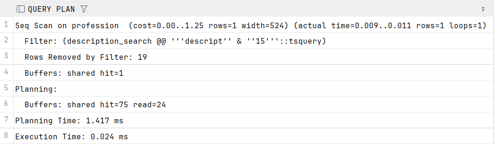
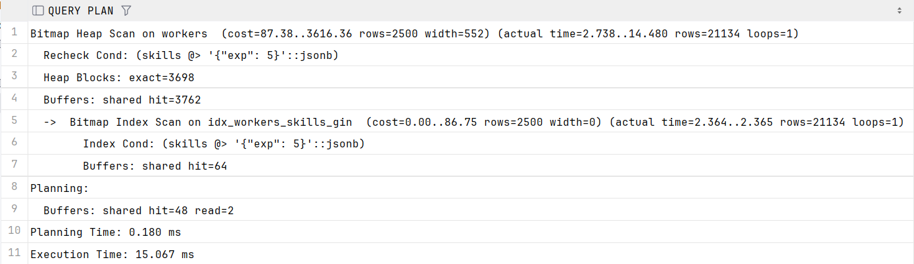
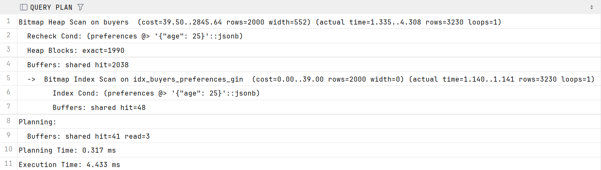
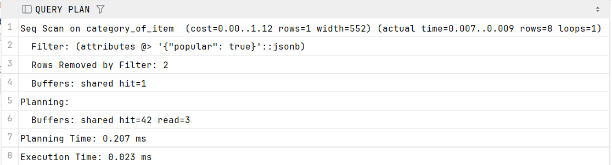
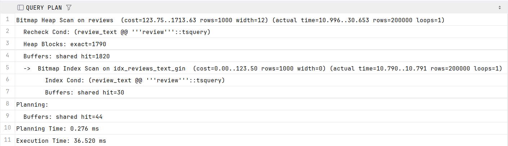
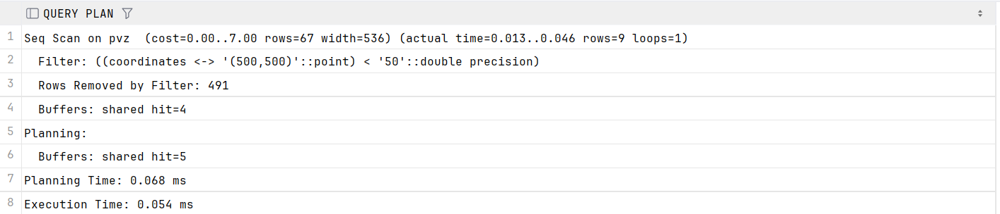
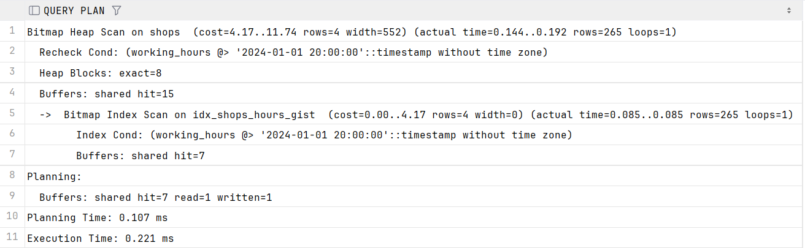
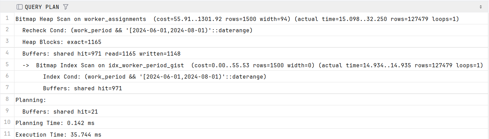
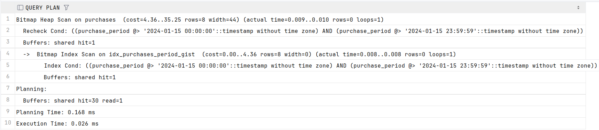
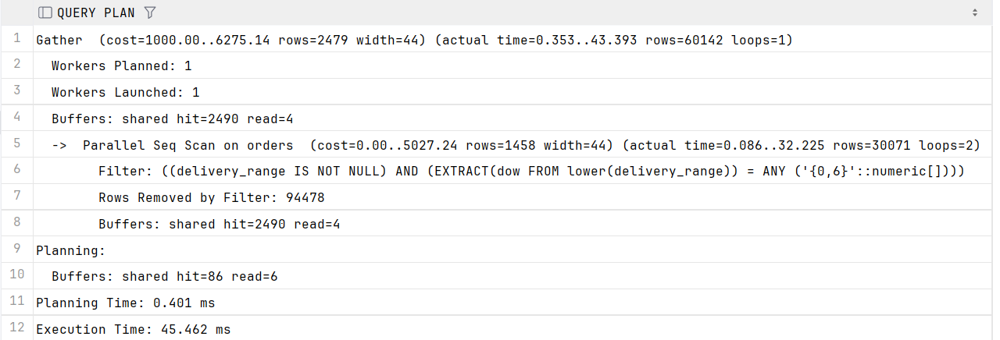

# GIN

```sql
-- GIN индекс 1: Полнотекстовый поиск по профессиям
CREATE INDEX idx_profession_description_gin ON profession USING GIN(description_search);
-- GIN индекс 2: Полнотекстовый поиск по отзывам
CREATE INDEX idx_reviews_text_gin ON reviews USING GIN(review_text);
-- GIN индекс 3: JSONB поиск по навыкам работников
CREATE INDEX idx_workers_skills_gin ON workers USING GIN(skills);
-- GIN индекс 4: JSONB поиск по предпочтениям покупателей
CREATE INDEX idx_buyers_preferences_gin ON buyers USING GIN(preferences);
-- GIN индекс 5: JSONB поиск по атрибутам категорий
CREATE INDEX idx_category_attributes_gin ON category_of_item USING GIN(attributes);
```

## Запрос 1

```sql
-- GIN запрос 1: Поиск профессий с ключевым словом в описании
EXPLAIN (ANALYZE, BUFFERS)
SELECT profession_id, name, salary
FROM profession
WHERE description_search @@ to_tsquery('russian', 'description & 15');
```



## Запрос 2

```sql
-- GIN запрос 2: Поиск работников с опытом 5 лет
EXPLAIN (ANALYZE, BUFFERS)
SELECT worker_id, login, skills->>'exp' as experience
FROM workers
WHERE skills @> '{"exp": 5}';
```



## Запрос 3

```sql
-- GIN запрос 3: Поиск покупателей с возрастом 25 лет
EXPLAIN (ANALYZE, BUFFERS)
SELECT buyer_id, login, preferences->>'age' as age
FROM buyers
WHERE preferences @> '{"age": 25}';
```



## Запрос 4

```sql
-- GIN запрос 4: Поиск популярных категорий товаров
EXPLAIN (ANALYZE, BUFFERS)
SELECT category_id, name, attributes
FROM category_of_item
WHERE attributes @> '{"popular": true}';
```



## Запрос 5

```sql
-- GIN запрос 5: Полнотекстовый поиск по отзывам
EXPLAIN (ANALYZE, BUFFERS)
SELECT review_id, purchase_id, rating
FROM reviews
WHERE review_text @@ to_tsquery('russian', 'review');
```



# GIST

```sql
-- GiST индекс 1: Пространственный поиск по координатам ПВЗ
CREATE INDEX idx_pvz_coordinates_gist ON pvz USING GIST(coordinates);
-- GiST индекс 2: Поиск по времени работы магазинов
CREATE INDEX idx_shops_hours_gist ON shops USING GIST(working_hours);
-- GiST индекс 3: Поиск по периодам работы сотрудников
CREATE INDEX idx_worker_period_gist ON worker_assignments USING GIST(work_period);
-- GiST индекс 4: Поиск по периодам покупок
CREATE INDEX idx_purchases_period_gist ON purchases USING GIST(purchase_period);
-- GiST индекс 5: Поиск по периодам доставки заказов
CREATE INDEX idx_orders_delivery_gist ON orders USING GIST(delivery_range);
```

## Запрос 1

```sql
-- Добавление дополнительных данных для репрезентативности
INSERT INTO pvz (address, coordinates)
SELECT 'address_' || i, point(random()*1000, random()*1000)
FROM generate_series(51, 500) i;

INSERT INTO shops (owner_id, name, working_hours)
SELECT floor(random() * 250000 + 1), 'shop_' || i,
       CASE WHEN random() < 0.7 THEN
                tsrange(
                        ('2024-01-01 ' || (8 + floor(random()*4))::int || ':00:00')::timestamp,
                        ('2024-01-01 ' || (18 + floor(random()*4))::int || ':00:00')::timestamp
                )
            ELSE NULL END
FROM generate_series(101, 1000) i;

-- GiST запрос 1: Поиск ПВЗ в радиусе 50 от точки (500,500)
EXPLAIN (ANALYZE, BUFFERS)
SELECT pvz_id, address, coordinates
FROM pvz
WHERE coordinates <-> point(500, 500) < 50;
```



## Запрос 2

```sql
-- GiST запрос 2: Поиск магазинов, работающих в 20:00
EXPLAIN (ANALYZE, BUFFERS)
SELECT shop_id, name, working_hours
FROM shops
WHERE working_hours @> '2024-01-01 20:00:00'::timestamp;
```



## Запрос 3

```sql
-- GiST запрос 3: Поиск сотрудников, работавших летом 2024
EXPLAIN (ANALYZE, BUFFERS)
SELECT worker_id, place_type, work_period
FROM worker_assignments
WHERE work_period && daterange('2024-06-01', '2024-08-01');
```



## Запрос 4

```sql
-- GiST запрос 4: Поиск покупок за 15 января 2024
EXPLAIN (ANALYZE, BUFFERS)
SELECT purchase_id, item_id, buyer_id, purchase_period
FROM purchases
WHERE purchase_period @> '2024-01-15 00:00:00'::timestamp
  AND purchase_period @> '2024-01-15 23:59:59'::timestamp;
```



## Запрос 5

```sql
-- GiST запрос 5: Поиск заказов с доставкой в выходные дни
EXPLAIN (ANALYZE, BUFFERS)
SELECT order_id, purchase_id, pvz_id, delivery_range
FROM orders
WHERE EXTRACT(DOW FROM lower(delivery_range)) IN (0, 6)
  AND delivery_range IS NOT NULL;
```



# JOIN

чтобы было интересней))

```sql
-- Индексы для JOIN запросов
CREATE INDEX idx_purchases_buyer_id ON purchases(buyer_id);
CREATE INDEX idx_purchases_item_id ON purchases(item_id);
CREATE INDEX idx_items_shop_id ON items(shop_id);
CREATE INDEX idx_orders_purchase_id ON orders(purchase_id);
CREATE INDEX idx_reviews_purchase_id ON reviews(purchase_id);
```

## Запрос 1

```sql
-- JOIN запрос 1: Покупки с информацией о покупателе и товаре
EXPLAIN (ANALYZE, BUFFERS)
SELECT
    p.purchase_id,
    p.purchase_date,
    b.login AS buyer,
    i.name AS item,
    i.price
FROM purchases p
         JOIN buyers b ON p.buyer_id = b.buyer_id
         JOIN items i ON p.item_id = i.item_id
    LIMIT 20;
```
```
+--------------------------------------------------------------------------------------------------------------------------------------------------------------+
|QUERY PLAN                                                                                                                                                    |
+--------------------------------------------------------------------------------------------------------------------------------------------------------------+
|Limit  (cost=1.81..8.44 rows=20 width=49) (actual time=0.506..7.859 rows=20 loops=1)                                                                          |
|  Buffers: shared hit=67 read=40                                                                                                                              |
|  ->  Nested Loop  (cost=1.81..99467.47 rows=300000 width=49) (actual time=0.504..7.852 rows=20 loops=1)                                                      |
|        Buffers: shared hit=67 read=40                                                                                                                        |
|        ->  Merge Join  (cost=1.38..33298.20 rows=300000 width=33) (actual time=0.027..0.115 rows=20 loops=1)                                                 |
|              Merge Cond: (p.item_id = i.item_id)                                                                                                             |
|              Buffers: shared hit=27                                                                                                                          |
|              ->  Index Scan using idx_purchases_item_id on purchases p  (cost=0.42..19448.39 rows=300000 width=20) (actual time=0.014..0.065 rows=20 loops=1)|
|                    Buffers: shared hit=23                                                                                                                    |
|              ->  Index Scan using items_pkey on items i  (cost=0.42..9474.81 rows=250000 width=21) (actual time=0.008..0.014 rows=18 loops=1)                |
|                    Buffers: shared hit=4                                                                                                                     |
|        ->  Memoize  (cost=0.43..0.49 rows=1 width=24) (actual time=0.385..0.385 rows=1 loops=20)                                                             |
|              Cache Key: p.buyer_id                                                                                                                           |
|              Cache Mode: logical                                                                                                                             |
|              Hits: 0  Misses: 20  Evictions: 0  Overflows: 0  Memory Usage: 3kB                                                                              |
|              Buffers: shared hit=40 read=40                                                                                                                  |
|              ->  Index Scan using buyers_pkey on buyers b  (cost=0.42..0.48 rows=1 width=24) (actual time=0.383..0.383 rows=1 loops=20)                      |
|                    Index Cond: (buyer_id = p.buyer_id)                                                                                                       |
|                    Buffers: shared hit=40 read=40                                                                                                            |
|Planning:                                                                                                                                                     |
|  Buffers: shared hit=233 read=23 dirtied=3                                                                                                                   |
|Planning Time: 3.448 ms                                                                                                                                       |
|Execution Time: 8.121 ms                                                                                                                                      |
+--------------------------------------------------------------------------------------------------------------------------------------------------------------+
```

## Запрос 2

```sql
-- JOIN запрос 2: Заказы с адресом ПВЗ
EXPLAIN (ANALYZE, BUFFERS)
SELECT
    o.order_id,
    o.order_date,
    o.status,
    pvz.address
FROM orders o
         JOIN pvz ON o.pvz_id = pvz.pvz_id
    LIMIT 20;
```

```
+--------------------------------------------------------------------------------------------------------------------------------+
|QUERY PLAN                                                                                                                      |
+--------------------------------------------------------------------------------------------------------------------------------+
|Limit  (cost=0.28..1.18 rows=20 width=32) (actual time=0.015..0.041 rows=20 loops=1)                                            |
|  Buffers: shared hit=55                                                                                                        |
|  ->  Nested Loop  (cost=0.28..11188.78 rows=249098 width=32) (actual time=0.013..0.038 rows=20 loops=1)                        |
|        Buffers: shared hit=55                                                                                                  |
|        ->  Seq Scan on orders o  (cost=0.00..4953.98 rows=249098 width=25) (actual time=0.005..0.006 rows=20 loops=1)          |
|              Buffers: shared hit=1                                                                                             |
|        ->  Memoize  (cost=0.28..0.30 rows=1 width=15) (actual time=0.001..0.001 rows=1 loops=20)                               |
|              Cache Key: o.pvz_id                                                                                               |
|              Cache Mode: logical                                                                                               |
|              Hits: 2  Misses: 18  Evictions: 0  Overflows: 0  Memory Usage: 3kB                                                |
|              Buffers: shared hit=54                                                                                            |
|              ->  Index Scan using pvz_pkey on pvz  (cost=0.27..0.29 rows=1 width=15) (actual time=0.001..0.001 rows=1 loops=18)|
|                    Index Cond: (pvz_id = o.pvz_id)                                                                             |
|                    Buffers: shared hit=54                                                                                      |
|Planning:                                                                                                                       |
|  Buffers: shared hit=92 read=1 dirtied=1                                                                                       |
|Planning Time: 0.356 ms                                                                                                         |
|Execution Time: 0.058 ms                                                                                                        |
+--------------------------------------------------------------------------------------------------------------------------------+
```

## Запрос 3

```sql
-- JOIN запрос 3: Отзывы с рейтингом и названием товара
EXPLAIN (ANALYZE, BUFFERS)
SELECT
    r.review_id,
    r.rating,
    r.description,
    i.name AS item_name
FROM reviews r
         JOIN purchases p ON r.purchase_id = p.purchase_id
         JOIN items i ON p.item_id = i.item_id
    LIMIT 20;
```

```
+-------------------------------------------------------------------------------------------------------------------------------------------------------------+
|QUERY PLAN                                                                                                                                                   |
+-------------------------------------------------------------------------------------------------------------------------------------------------------------+
|Limit  (cost=1.68..13.50 rows=20 width=31) (actual time=0.607..6.114 rows=20 loops=1)                                                                        |
|  Buffers: shared hit=68 read=20                                                                                                                             |
|  ->  Nested Loop  (cost=1.68..118267.69 rows=200000 width=31) (actual time=0.606..6.105 rows=20 loops=1)                                                    |
|        Buffers: shared hit=68 read=20                                                                                                                       |
|        ->  Merge Join  (cost=1.26..21037.09 rows=200000 width=24) (actual time=0.024..0.099 rows=20 loops=1)                                                |
|              Merge Cond: (r.purchase_id = p.purchase_id)                                                                                                    |
|              Buffers: shared hit=8                                                                                                                          |
|              ->  Index Scan using idx_reviews_purchase_id on reviews r  (cost=0.42..7001.72 rows=200000 width=24) (actual time=0.014..0.035 rows=20 loops=1)|
|                    Buffers: shared hit=4                                                                                                                    |
|              ->  Index Scan using purchases_pkey on purchases p  (cost=0.42..10846.33 rows=300000 width=8) (actual time=0.006..0.028 rows=27 loops=1)       |
|                    Buffers: shared hit=4                                                                                                                    |
|        ->  Index Scan using items_pkey on items i  (cost=0.42..0.49 rows=1 width=15) (actual time=0.298..0.298 rows=1 loops=20)                             |
|              Index Cond: (item_id = p.item_id)                                                                                                              |
|              Buffers: shared hit=60 read=20                                                                                                                 |
|Planning:                                                                                                                                                    |
|  Buffers: shared hit=95 read=9                                                                                                                              |
|Planning Time: 2.272 ms                                                                                                                                      |
|Execution Time: 6.176 ms                                                                                                                                     |
+-------------------------------------------------------------------------------------------------------------------------------------------------------------+
```

## Запрос 4

```sql
-- JOIN запрос 4: Работники и их профессии
EXPLAIN (ANALYZE, BUFFERS)
SELECT
    w.login,
    pr.name AS profession,
    pr.salary
FROM worker_assignments wa
         JOIN workers w ON wa.worker_id = w.worker_id
         JOIN profession pr ON wa.work_id = pr.profession_id
    LIMIT 20;
```

```
+--------------------------------------------------------------------------------------------------------------------------------------------------+
|QUERY PLAN                                                                                                                                        |
+--------------------------------------------------------------------------------------------------------------------------------------------------+
|Limit  (cost=0.58..12.20 rows=20 width=541) (actual time=0.613..3.788 rows=20 loops=1)                                                            |
|  Buffers: shared hit=86 read=19                                                                                                                  |
|  ->  Nested Loop  (cost=0.58..87153.36 rows=150000 width=541) (actual time=0.612..3.782 rows=20 loops=1)                                         |
|        Buffers: shared hit=86 read=19                                                                                                            |
|        ->  Nested Loop  (cost=0.43..83501.91 rows=150000 width=25) (actual time=0.332..3.434 rows=20 loops=1)                                    |
|              Buffers: shared hit=64 read=17                                                                                                      |
|              ->  Seq Scan on worker_assignments wa  (cost=0.00..2665.00 rows=150000 width=8) (actual time=0.008..0.014 rows=20 loops=1)          |
|                    Buffers: shared hit=1                                                                                                         |
|              ->  Memoize  (cost=0.43..0.56 rows=1 width=25) (actual time=0.170..0.170 rows=1 loops=20)                                           |
|                    Cache Key: wa.worker_id                                                                                                       |
|                    Cache Mode: logical                                                                                                           |
|                    Hits: 0  Misses: 20  Evictions: 0  Overflows: 0  Memory Usage: 3kB                                                            |
|                    Buffers: shared hit=63 read=17                                                                                                |
|                    ->  Index Scan using workers_pkey on workers w  (cost=0.42..0.55 rows=1 width=25) (actual time=0.168..0.168 rows=1 loops=20)  |
|                          Index Cond: (worker_id = wa.worker_id)                                                                                  |
|                          Buffers: shared hit=63 read=17                                                                                          |
|        ->  Memoize  (cost=0.15..0.17 rows=1 width=524) (actual time=0.016..0.016 rows=1 loops=20)                                                |
|              Cache Key: wa.work_id                                                                                                               |
|              Cache Mode: logical                                                                                                                 |
|              Hits: 8  Misses: 12  Evictions: 0  Overflows: 0  Memory Usage: 2kB                                                                  |
|              Buffers: shared hit=22 read=2                                                                                                       |
|              ->  Index Scan using profession_pkey on profession pr  (cost=0.14..0.16 rows=1 width=524) (actual time=0.025..0.025 rows=1 loops=12)|
|                    Index Cond: (profession_id = wa.work_id)                                                                                      |
|                    Buffers: shared hit=22 read=2                                                                                                 |
|Planning:                                                                                                                                         |
|  Buffers: shared hit=90 read=2 dirtied=2                                                                                                         |
|Planning Time: 1.897 ms                                                                                                                           |
|Execution Time: 3.955 ms                                                                                                                          |
+--------------------------------------------------------------------------------------------------------------------------------------------------+
```

## Запрос 5

```sql
-- JOIN запрос 5: Товары и их категории
EXPLAIN (ANALYZE, BUFFERS)
SELECT
    i.name AS item,
    i.price,
    c.name AS category
FROM items i
         JOIN category_of_item c ON i.category_id = c.category_id
    LIMIT 20;
```

```
+------------------------------------------------------------------------------------------------------------------------------------------------------------+
|QUERY PLAN                                                                                                                                                  |
+------------------------------------------------------------------------------------------------------------------------------------------------------------+
|Limit  (cost=0.15..1.06 rows=20 width=533) (actual time=0.429..0.450 rows=20 loops=1)                                                                       |
|  Buffers: shared hit=15 read=2                                                                                                                             |
|  ->  Nested Loop  (cost=0.15..11406.84 rows=250000 width=533) (actual time=0.428..0.448 rows=20 loops=1)                                                   |
|        Buffers: shared hit=15 read=2                                                                                                                       |
|        ->  Seq Scan on items i  (cost=0.00..5462.00 rows=250000 width=21) (actual time=0.006..0.008 rows=20 loops=1)                                       |
|              Buffers: shared hit=1                                                                                                                         |
|        ->  Memoize  (cost=0.15..0.16 rows=1 width=520) (actual time=0.021..0.021 rows=1 loops=20)                                                          |
|              Cache Key: i.category_id                                                                                                                      |
|              Cache Mode: logical                                                                                                                           |
|              Hits: 12  Misses: 8  Evictions: 0  Overflows: 0  Memory Usage: 1kB                                                                            |
|              Buffers: shared hit=14 read=2                                                                                                                 |
|              ->  Index Scan using category_of_item_pkey on category_of_item c  (cost=0.14..0.15 rows=1 width=520) (actual time=0.051..0.051 rows=1 loops=8)|
|                    Index Cond: (category_id = i.category_id)                                                                                               |
|                    Buffers: shared hit=14 read=2                                                                                                           |
|Planning:                                                                                                                                                   |
|  Buffers: shared hit=38 read=2                                                                                                                             |
|Planning Time: 3.086 ms                                                                                                                                     |
|Execution Time: 0.472 ms                                                                                                                                    |
+------------------------------------------------------------------------------------------------------------------------------------------------------------+
```