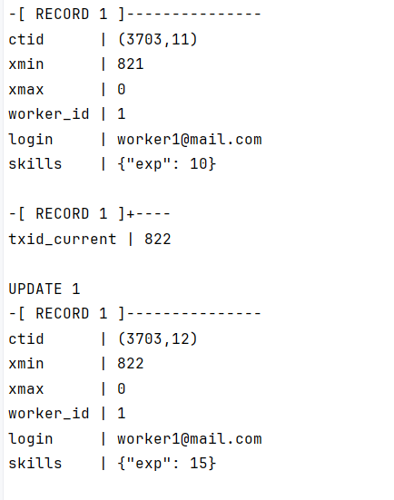
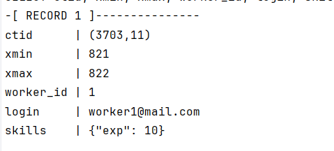
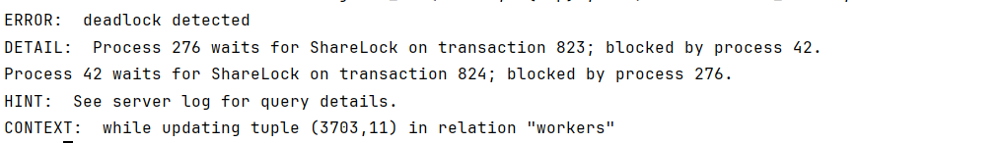

```sql
-- Начинаем транзакцию
BEGIN;

-- Смотрим на строку ДО изменений
SELECT ctid, xmin, xmax, worker_id, login, skills
FROM workers WHERE worker_id = 1;

SELECT txid_current();
UPDATE workers SET skills = jsonb_set(skills, '{exp}', '10') WHERE worker_id = 1;

-- Смотрим на строку ПОСЛЕ обновления ВНУТРИ этой же транзакции
SELECT ctid, xmin, xmax, worker_id, login, skills
FROM workers WHERE worker_id = 1;

-- Не закрывайте транзакцию
```



вторая консоль

```sql
SELECT ctid, xmin, xmax, worker_id, login, skills
FROM workers WHERE worker_id = 1;
```



### Deadlock

1

```sql
BEGIN;
-- Блокируем первого работника
UPDATE workers SET skills = jsonb_set(skills, '{exp}', '20') WHERE worker_id = 1;
```

2

```sql
BEGIN;
-- Блокируем первого работника
UPDATE workers SET skills = jsonb_set(skills, '{exp}', '20') WHERE worker_id = 2;
```

1

```sql
UPDATE workers SET skills = jsonb_set(skills, '{exp}', '5') WHERE worker_id = 2;
```

2

```sql
UPDATE workers SET skills = jsonb_set(skills, '{exp}', '5') WHERE worker_id = 1;
```



## FOR UPDATE

```sql
BEGIN;
SELECT worker_id, login, skills 
FROM workers 
WHERE worker_id = 5 
FOR UPDATE;
```

```sql
BEGIN;

-- 1. FOR KEY SHARE — ЖДЁТ
SELECT * FROM workers WHERE worker_id = 5 FOR KEY SHARE;
-- (зависнет)

-- 2. FOR SHARE — ЖДЁТ
SELECT * FROM workers WHERE worker_id = 5 FOR SHARE;
-- (зависнет)

-- 3. FOR NO KEY UPDATE — ЖДЁТ
SELECT * FROM workers WHERE worker_id = 5 FOR NO KEY UPDATE;
-- (зависнет)

-- 4. FOR UPDATE — ЖДЁТ
SELECT * FROM workers WHERE worker_id = 5 FOR UPDATE;
-- (зависнет)
```

## FOR KEY SHARE

```sql
BEGIN;
SELECT * FROM workers WHERE worker_id = 5 FOR KEY SHARE;
```

```sql
BEGIN;

-- 1. FOR KEY SHARE — ПРОХОДИТ
SELECT * FROM workers WHERE worker_id = 5 FOR KEY SHARE;

-- 2. FOR SHARE — ПРОХОДИТ
SELECT * FROM workers WHERE worker_id = 5 FOR SHARE;

-- 3. FOR NO KEY UPDATE — ПРОХОДИТ
SELECT * FROM workers WHERE worker_id = 5 FOR NO KEY UPDATE;

-- 4. FOR UPDATE — ЖДЁТ
SELECT * FROM workers WHERE worker_id = 5 FOR UPDATE;
```

## FOR SHARE

```sql
BEGIN;
SELECT * FROM workers WHERE worker_id = 5 FOR SHARE;
```

```sql
BEGIN;

-- 1. FOR KEY SHARE — ПРОХОДИТ
SELECT * FROM workers WHERE worker_id = 5 FOR KEY SHARE;

-- 2. FOR SHARE — ПРОХОДИТ
SELECT * FROM workers WHERE worker_id = 5 FOR SHARE;

-- 3. FOR NO KEY UPDATE — ЖДЁТ
SELECT * FROM workers WHERE worker_id = 5 FOR NO KEY UPDATE;
-- (зависнет, ждет Терминал 1)

-- 4. FOR UPDATE — ЖДЁТ
SELECT * FROM workers WHERE worker_id = 5 FOR UPDATE;
```

## FOR NO KEY UPDATE

```sql
BEGIN;
SELECT * FROM workers WHERE worker_id = 5 FOR NO KEY UPDATE;
```

```sql
BEGIN;

-- 1. FOR KEY SHARE — ПРОХОДИТ
SELECT * FROM workers WHERE worker_id = 5 FOR KEY SHARE;

-- 2. FOR SHARE — ЖДЁТ
SELECT * FROM workers WHERE worker_id = 5 FOR SHARE;

-- 3. FOR NO KEY UPDATE — ЖДЁТ
SELECT * FROM workers WHERE worker_id = 5 FOR NO KEY UPDATE;

-- 4. FOR UPDATE — ЖДЁТ
SELECT * FROM workers WHERE worker_id = 5 FOR UPDATE;
```