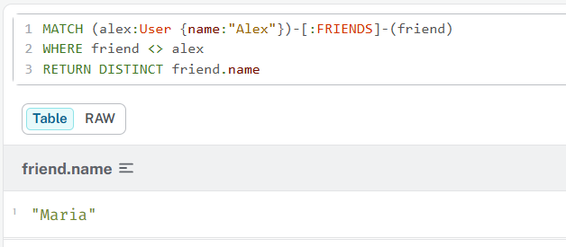
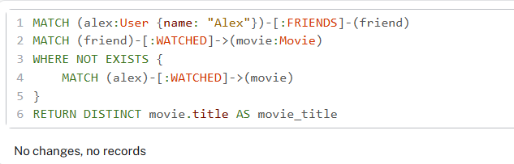

**ДЗ**

Задать структуру:

```
CREATE (alex:User {name: "Alex"}),
       (maria:User {name: "Maria"}),
       (john:User {name: "John"})

CREATE (inception:Movie {title: "Inception"}),
       (matrix:Movie {title: "The Matrix"})

MATCH (a:User {name: "Alex"}), (m:User {name: "Maria"})
CREATE (a)-[:FRIENDS]->(m)

MATCH (a:User {name: "Alex"}), (i:Movie {title: "Inception"})
CREATE (a)-[:WATCHED {rating: 5}]->(i)
```

Выполнить запросы:

- Найти всех друзей Алекса

---



---

- Найти фильмы, которые смотрели друзья Алекса, но не смотрел сам Алекс


---



---


Сравнить:

- Написать аналогичный запрос на SQL

---

```sql
SELECT DISTINCT m.title AS movie_title
FROM Users alex
JOIN Friends f ON f.user_id = alex.id
JOIN Users friend ON friend.id = f.friend_id
JOIN Watched w ON w.user_id = friend.id
JOIN Movies m ON m.id = w.movie_id
WHERE alex.name = 'Alex'
  AND NOT EXISTS (
    SELECT 1
    FROM Watched w2
    WHERE w2.user_id = alex.id
      AND w2.movie_id = m.id
  )
```

---

- Сравнить сложность запросов

---

Написание труднее

---

