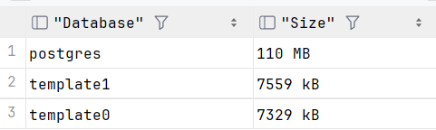
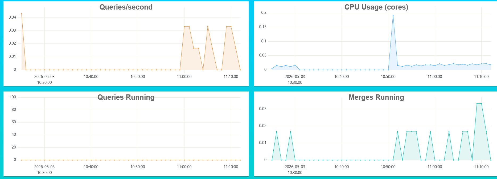

# Задание 1

## Готовая таблица + данные

```
	CREATE TABLE web_logs (
    log_time DateTime,
    ip String,
    url String,
    status_code UInt16,
    response_size UInt64
	) ENGINE = MergeTree()
	ORDER BY (log_time, status_code);
```

```
	INSERT INTO web_logs
	SELECT
    toDateTime('2024-03-01 00:00:00') + INTERVAL number SECOND,
    concat('192.168.0.', toString(number % 50)),
    arrayElement(['/home', '/api/users', '/api/orders', '/admin', '/products'], number % 5 + 1),
    arrayElement([200, 200, 200, 404, 500, 301, 200], number % 7 + 1),
    rand() % 1000000
	FROM numbers(500000);
```

---

```bash
CREATE TABLE web_logs
(
    `log_time` DateTime,
    `ip` String,
    `url` String,
    `status_code` UInt16,
    `response_size` UInt64
)
ENGINE = MergeTree
ORDER BY (log_time, status_code)

Query id: 4769ee29-84f3-44aa-ad5c-5d9fc626d2e7

Ok.

0 rows in set. Elapsed: 0.008 sec.
INSERT INTO web_logs SELECT
    toDateTime('2024-03-01 00:00:00') + toIntervalSecond(number),
    concat('192.168.0.', toString(number % 50)),
    arrayElement(['/home', '/api/users', '/api/orders', '/admin', '/products'], (number % 5) + 1),
    arrayElement([200, 200, 200, 404, 500, 301, 200], (number % 7) + 1),
    rand() % 1000000
FROM numbers(500000)

Query id: 0b795619-0427-4331-b874-160b21c9f758

Ok.                                                                                                                                                                                 

500000 rows in set. Elapsed: 0.048 sec. Processed 500.00 thousand rows, 4.00 MB (10.46 million rows/s., 83.67 MB/s.)
Peak memory usage: 40.06 MiB.
```

---

## Таски

1. Найдите топ-10 IP-адресов по количеству запросов.

```bash
SELECT
    ip,
    COUNT(*) AS request_count
FROM web_logs
GROUP BY ip
ORDER BY request_count DESC
LIMIT 10

Query id: 24ba2657-b7ef-46bd-9a1d-b9809e84c37b

    ┌─ip───────────┬─request_count─┐                                                                                                                                                
 1. │ 192.168.0.48 │         10000 │
 2. │ 192.168.0.22 │         10000 │
 3. │ 192.168.0.8  │         10000 │
 4. │ 192.168.0.11 │         10000 │
 5. │ 192.168.0.46 │         10000 │
 6. │ 192.168.0.37 │         10000 │
 7. │ 192.168.0.18 │         10000 │
 8. │ 192.168.0.1  │         10000 │
 9. │ 192.168.0.0  │         10000 │
10. │ 192.168.0.43 │         10000 │
    └──────────────┴───────────────┘

10 rows in set. Elapsed: 0.007 sec. Processed 500.00 thousand rows, 7.40 MB (72.00 million rows/s., 1.07 GB/s.)
Peak memory usage: 10.06 MiB.
```
---
2. Посчитайте процент успешных запросов (2xx) и ошибочных (4xx, 5xx).

```bash
SELECT
    round((sumIf(1, (status_code >= 200) AND (status_code <= 299)) / count(*)) * 100, 2) AS success_rate,
    round((sumIf(1, (status_code >= 400) AND (status_code <= 499)) / count(*)) * 100, 2) AS client_error_rate,
    round((sumIf(1, (status_code >= 500) AND (status_code <= 599)) / count(*)) * 100, 2) AS server_error_rate
FROM web_logs

Query id: afb6f28a-f120-4946-b0ac-8e21c70e52e6

   ┌─success_rate─┬─client_error_rate─┬─server_error_rate─┐                                                                                                                         
1. │        57.14 │             14.29 │             14.29 │
   └──────────────┴───────────────────┴───────────────────┘

1 row in set. Elapsed: 0.005 sec. Processed 500.00 thousand rows, 1.00 MB (94.66 million rows/s., 189.31 MB/s.)
Peak memory usage: 1.57 MiB.
```
---
3. Найдите самый популярный URL и средний размер ответа для него.

```bash
SELECT
    url,
    COUNT(*) AS hit_count,
    round(AVG(response_size), 2) AS avg_response_size,
    MIN(response_size) AS min_size,
    MAX(response_size) AS max_size
FROM web_logs
GROUP BY url
ORDER BY hit_count DESC
LIMIT 1

Query id: f80505cb-5f06-43bb-b259-c77e1f7e8f81

   ┌─url───┬─hit_count─┬─avg_response_size─┬─min_size─┬─max_size─┐                                                                                                                  
1. │ /home │    100000 │          498256.7 │       14 │   999974 │
   └───────┴───────────┴───────────────────┴──────────┴──────────┘

1 row in set. Elapsed: 0.009 sec. Processed 500.00 thousand rows, 9.60 MB (56.95 million rows/s., 1.09 GB/s.)
Peak memory usage: 11.40 MiB.
```
---
4. Определите час с наибольшим количеством ошибок 500.

```bash
SELECT
    toHour(log_time) AS hour,
    COUNT(*) AS error_500_count
FROM web_logs
WHERE status_code = 500
GROUP BY hour
ORDER BY error_500_count DESC
LIMIT 1

Query id: 4005c4bb-2b36-4126-903b-c475c7a7b53d

   ┌─hour─┬─error_500_count─┐                                                                                                                                                       
1. │    0 │            3086 │
   └──────┴─────────────────┘

1 row in set. Elapsed: 0.006 sec. Processed 500.00 thousand rows, 3.00 MB (85.19 million rows/s., 511.16 MB/s.)
Peak memory usage: 2.22 MiB.
```

---
# Задание 2

## Сравнение с PostgreSQL

```
	CREATE TABLE sales_ch (
    sale_date DateTime,
    product_id UInt64,
    category String,
    quantity UInt32,
    price Float64,
    customer_id UInt64
	) ENGINE = MergeTree()
	ORDER BY (sale_date);

	INSERT INTO sales_ch
	SELECT
    toDateTime('2024-01-01 00:00:00') + INTERVAL number MINUTE,
    number % 1000,
    arrayElement(['Electronics', 'Clothing', 'Food', 'Books'], number % 4 + 1),
    rand() % 10 + 1,
    round(rand() % 10000 / 100, 2),
    number % 50000
	FROM numbers(1000000);
```

---
```bash
CREATE TABLE sales_ch
(
    `sale_date` DateTime,
    `product_id` UInt64,
    `category` String,
    `quantity` UInt32,
    `price` Float64,
    `customer_id` UInt64
)
ENGINE = MergeTree
ORDER BY sale_date

Query id: 46a02ec2-432d-429d-8363-c7bdf2a7b7b4

Ok.

0 rows in set. Elapsed: 0.008 sec.


INSERT INTO sales_ch SELECT
    toDateTime('2024-01-01 00:00:00') + toIntervalMinute(number),
    number % 1000,
    arrayElement(['Electronics', 'Clothing', 'Food', 'Books'], (number % 4) + 1),
    (rand() % 10) + 1,
    round((rand() % 10000) / 100, 2),
    number % 50000
FROM numbers(1000000)

Query id: c4c58008-2e17-4c1e-8e84-e08af215cfaf

Ok.                                                                                                                                                                                 

1000000 rows in set. Elapsed: 0.100 sec. Processed 1.00 million rows, 8.00 MB (10.03 million rows/s., 80.21 MB/s.)
Peak memory usage: 61.32 MiB.
```
---

```
	CREATE TABLE sales_pg (
    sale_date timestamp,
    product_id bigint,
    category text,
    quantity integer,
    price float8,
    customer_id bigint
	);

	CREATE INDEX idx_sales_pg_date ON sales_pg(sale_date);
	CREATE INDEX idx_sales_pg_product ON sales_pg(product_id);

	INSERT INTO sales_pg
	SELECT
    '2024-01-01 00:00:00'::timestamp + (n || ' minutes')::interval,
    n % 1000,
    CASE (n % 4)
        WHEN 0 THEN 'Electronics'
        WHEN 1 THEN 'Clothing'
        WHEN 2 THEN 'Food'
        ELSE 'Books'
    END,
    (random() * 9 + 1)::integer,
    round((random() * 100)::numeric, 2),
    n % 50000
	FROM generate_series(1, 1000000) AS n;
```

```sql
[2026-05-03 14:22:07] completed in 7 ms
postgres.public> INSERT INTO sales_pg
                 SELECT
                     '2024-01-01 00:00:00'::timestamp + (n || ' minutes')::interval,
                     n % 1000,
                     CASE (n % 4)
                         WHEN 0 THEN 'Electronics'
                         WHEN 1 THEN 'Clothing'
                         WHEN 2 THEN 'Food'
                         ELSE 'Books'
                         END,
                     (random() * 9 + 1)::integer,
                     round((random() * 100)::numeric, 2),
                     n % 50000
                 FROM generate_series(1, 1000000) AS n
[2026-05-03 14:22:25] 1,000,000 rows affected in 4 s 189 ms
```

## Выполните замеры и сделайте выводы

### Запросы

1. Продажи за последний месяц

#### Clickhouse

---
```bash
SELECT
    toDate(sale_date) AS date,
    COUNT(*) AS number_of_transactions,
    SUM(quantity) AS total_quantity,
    SUM(quantity * price) AS total_revenue,
    round(AVG(price), 2) AS avg_price
FROM sales_ch
WHERE sale_date >= (now() - toIntervalDay(30))
GROUP BY date
ORDER BY date DESC

Query id: c1a1cae0-b11f-4a4a-a25a-5eab59dd700d

Ok.                                                                                                                                                                                 

0 rows in set. Elapsed: 0.005 sec.
```
---

#### PostgreSQL

---

```sql
postgres.public> SELECT
                     DATE(sale_date) AS date,
                     COUNT(*) AS number_of_transactions,
                     SUM(quantity) AS total_quantity,
                     SUM(quantity * price) AS total_revenue,
                     ROUND(AVG(price)::NUMERIC, 2) AS avg_price
                 FROM sales_pg
                 WHERE sale_date >= NOW() - INTERVAL '30 days'
                 GROUP BY DATE(sale_date)
                 ORDER BY date DESC
[2026-05-03 14:24:44] 0 rows retrieved in 361 ms (execution: 13 ms, fetching: 348 ms)
```

---

2. Размер данных

61.32 MiB - Clickhouse



## Ответьте на вопросы:

1. Какая СУБД быстрее вставила 1 млн строк?
**clickhouse**
2. Во сколько раз ClickHouse сжал данные эффективнее?
**почти в 2 раза**
3. Какой вывод можно сделать о выборе СУБД для аналитики?
**Clickhouse надо использовать**
4. Разница ClickHouse и PostgreSQL:
**OLAP и OLTP**

# Задние 3

Потыкаться в http://localhost:8123, посмотреть dashboard

