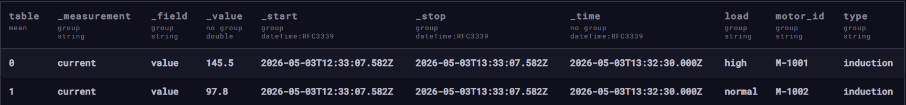
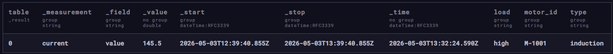
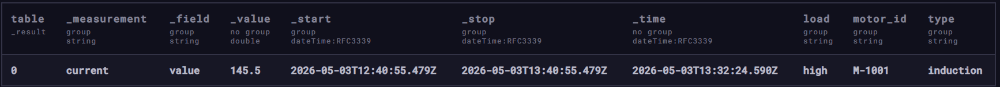
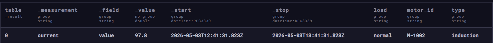
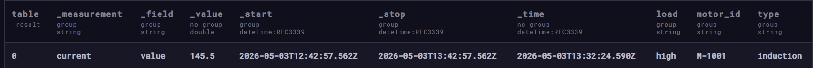
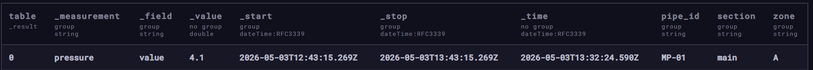
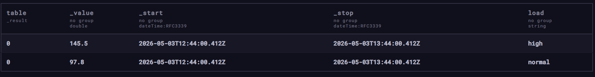
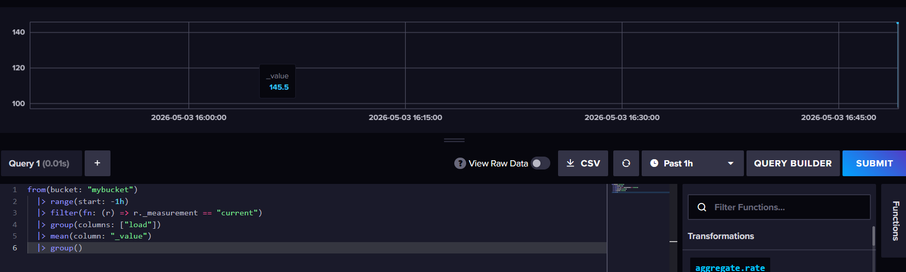
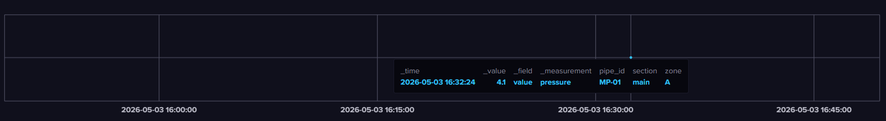

# InfluxDB — Домашнее задание

---

## Задание 1. Установка и запуск InfluxDB

## Задание 2. Создание базы через веб-интерфейс

## Задание 3. Наполнение данными (промышленных) датчиков

## Пример:

Потребляемый ток электродвигателями: current,motor_id=M-1001,type=induction,load=high value=145.5

Давление в трубопроводе: pressure,pipe_id=MP-01,section=main,zone=A value=4.2

```bash
# Датчик тока двигателя M-1001
current,motor_id=M-1001,type=induction,load=high value=145.5

# Датчик тока двигателя M-1002 (для сравнения)
current,motor_id=M-1002,type=induction,load=normal value=98.3
current,motor_id=M-1002,type=induction,load=normal value=102.1
current,motor_id=M-1002,type=induction,load=normal value=97.8

# Давление в трубопроводе MP-01
pressure,pipe_id=MP-01,section=main,zone=A value=4.2
pressure,pipe_id=MP-01,section=main,zone=A value=4.5
pressure,pipe_id=MP-01,section=main,zone=A value=4.1

# Вибрация насоса PU-101
vibration,pump_id=PU-101,location=base value=0.23
vibration,pump_id=PU-101,location=base value=0.28
vibration,pump_id=PU-101,location=base value=0.21
```

## Задание 4. Базовые запросы

- Просмотреть все данные за последние 30 минут

```bash
from(bucket: "mybucket")
  |> range(start: -30m)
  |> sort(columns: ["_time"])
```



- Посмотреть измерения только 1 датчика

```bash
from(bucket: "mybucket")
  |> range(start: -1h)
  |> filter(fn: (r) => r._measurement == "current")
  |> filter(fn: (r) => r.motor_id == "M-1001")
```



- Максимальное значение на 1 датчике

```bash
from(bucket: "mybucket")
  |> range(start: -1h)
  |> filter(fn: (r) => r._measurement == "current")
  |> filter(fn: (r) => r.motor_id == "M-1001")
  |> max(column: "_value")
```



- Среднее значение на датчике

```bash
from(bucket: "mybucket")
  |> range(start: -1h)
  |> filter(fn: (r) => r._measurement == "current")
  |> filter(fn: (r) => r.motor_id == "M-1002")
  |> mean(column: "_value")
```



- 2-3 аналитических запроса с фильтром по значению

```bash
from(bucket: "mybucket")
  |> range(start: -1h)
  |> filter(fn: (r) => r._measurement == "current")
  |> filter(fn: (r) => r._value > 100)
  |> sort(columns: ["_value"], desc: true)
```



```bash
from(bucket: "mybucket")
  |> range(start: -1h)
  |> filter(fn: (r) => r._measurement == "pressure")
  |> filter(fn: (r) => r._value < 4.3 or r._value > 4.6)
  |> sort(columns: ["_time"])
```



- Запрос на агрегацию данных

```bash
from(bucket: "mybucket")
  |> range(start: -1h)
  |> filter(fn: (r) => r._measurement == "current")
  |> group(columns: ["load"])
  |> mean(column: "_value")
  |> group()
```



## Задание 5. Создайте Dashboard с 1-2 графиками


